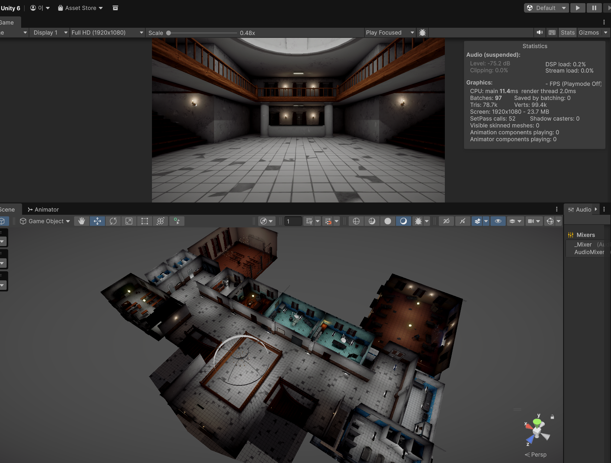
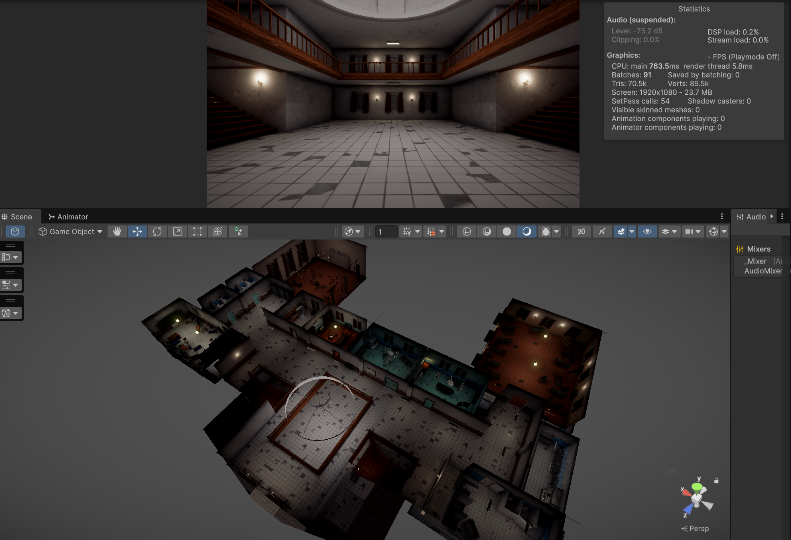
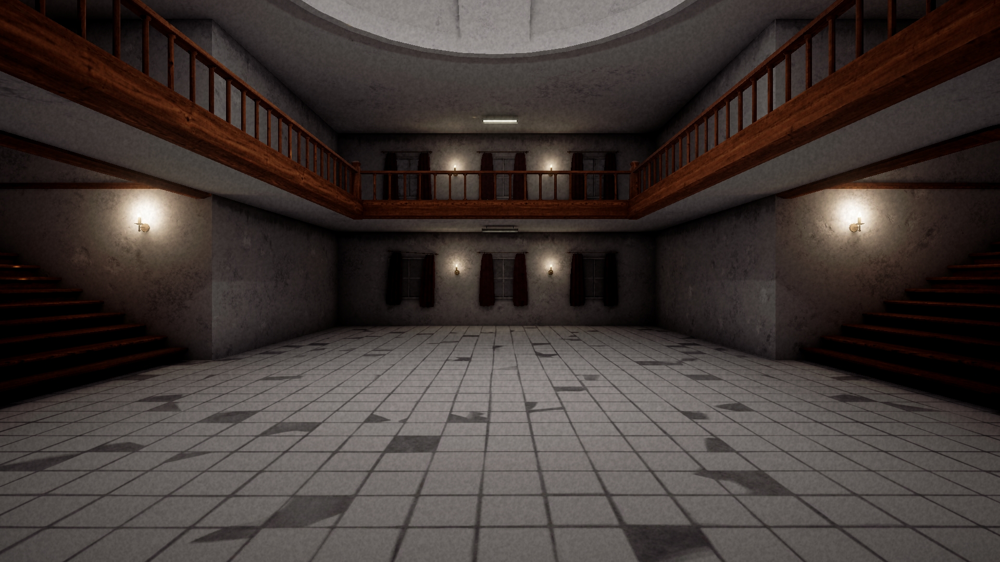
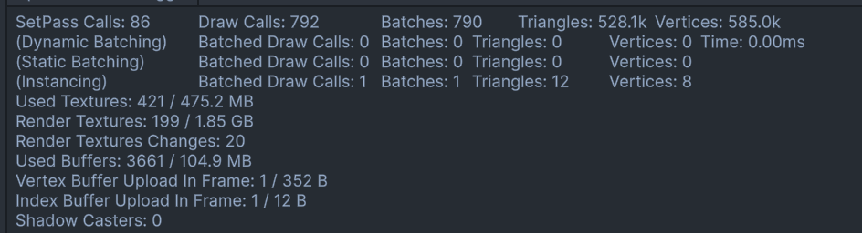
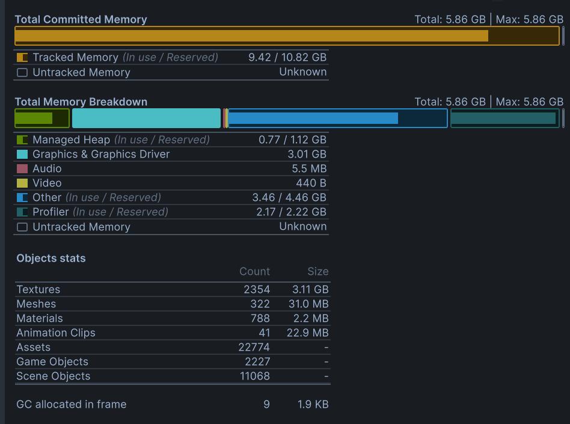
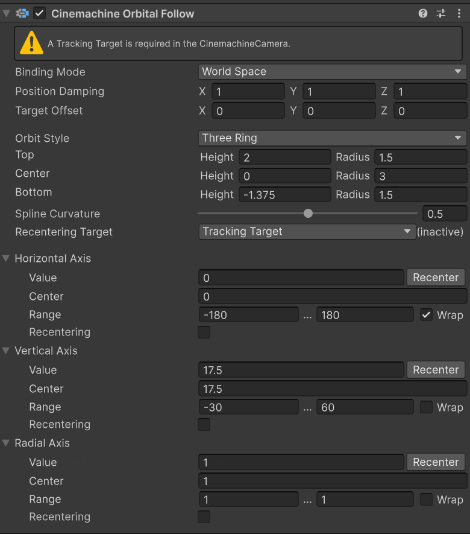
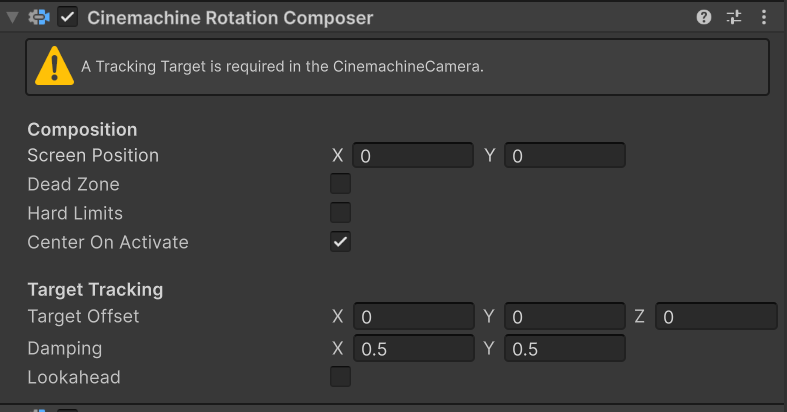
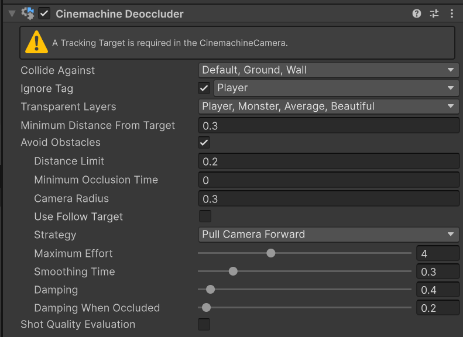

# 네트워크 팀프로젝트_작업 노트

**작성자**: 이성규  
**게임명**: 낯선 곳에 잡혀왔지만 괴물은 갇혀있으니 럭키비키\~\!★ (임시)  
**작성일**: 2026-04-24  
**최종 수정**: 2026-04-24  

## 프로젝트 개요

- **진행 기간**: 2026.04.24(금)~2026.05.18(목)
- **개발 환경**: Unity / C# / URP 3D / UGS + Relay
- **유니티 버전**: 6.3 LTS

# 작업 일지

## Day 1 — 2026-04-24

기초 프로젝트 세팅 및 팀 작업 방향 상담 및 회의


main 브랜치 Ruleset 생성으로 휴먼 이슈로 인한 main 브랜치 커밋이나 풀리퀘 체크 과정 추가.

가이드 문서, 역할 분담 문서 등 팀 문서 양식 작성.

## Day 2 — 2026-04-25

유니티 최적화 가이드 문서 작성  
프로젝트 에셋 파일 확인  
Project Auditor 패키지를 통한 프로젝트 파일 분석


라이트 베이킹은 에셋 자체에서 잘 설정되어 있어 별도 작업 없이 패스. 텍스쳐 목록을 확인하고 용량이 큰 순으로 해당 에셋이 적용되는 씬을 살펴보며 Max Size 조정.


VRWorldToolkit을 사용해 다시 텍스쳐를 상세히 확인하고 관리. 오리지널 사이즈보다 큰 MaxSize를 가진 텍스쳐의 MaxSize를 조정.  
`t:Texture`를 통해 전체 텍스쳐 사이즈 확인 완료.

> Unity의 Max Size는 임포트되는 GPU 메모리 / 빌드 크기에만 영향을 주고 원본 PNG 파일 자체는 그대로 남는다. 공유 패키지(Google Drive) 크기까지 줄이려면 원본 리사이즈가 별도로 필요.


실제 원본 용량 감소를 위해 `너비:>4000`을 에셋 임포트 폴더에 검색해 4000 사이즈 이상의 텍스쳐 이미지를 전부 선택 후 XnConvert를 통해 2048 사이즈로 변환해 덮어씌움 (스카이박스 제외 — 큐브맵 특성상 해상도 유지 필요).


수동으로 작업한 몇 개의 파일을 제외하고 77개의 파일 자동 변환 성공.

```
전체 입력 파일 크기: 731.87 MiB
전체 출력 파일 크기: 245.97 MiB
파일 크기 비: -66%
```

> Imports 폴더는 .gitignore 대상이라 Git 저장소엔 영향 없음. 다만 팀 공유 패키지(Google Drive) 크기가 줄어 신규 팀원 셋업 / 재다운로드 시 시간 단축 효과.

위 과정을 통해 3.05GB로 기존에 공유받은 Imports 폴더의 패키지 용랑을 3.05GB에서 2.32GB로 용량 감소 성공.

## Day 3 — 2026-04-26

룩뎁 샘플씬 작업 진행. 라이팅 / 컬링 / PPS 세 영역으로 나눠 진행했고, 동일 씬에서 Profiler·Stats로 실시간 검증.

### 라이팅 베이크 전략

씬 내 95개 라이트 중 대다수를 Baked로 전환하여 최적화 기반 마련. 호러 장르 특성상 정적 조명 비중이 압도적이라 Mixed보다 Baked 우선 전략이 효율적.

- 촛불 모델링의 그림자 외곽선 자연스러움을 위해 **Baked Shadow Radius** 값 조절
- 조명 Temperature **4000K** 적용 → 실내 화이트 밸런스 조정 (따뜻한 톤 ↔ 차가운 분위기 균형)
- 대량의 천장등을 Area Light로 전환하는 작업은 추후 여유 시간에 폴리싱으로 진행

### GI: APV 적용

작업 시간 효율을 고려해 **APV(Adaptive Probe Volumes)** 적용. 기존 Light Probe Group 수동 배치 대비 자동 분포 + 일관된 품질로 시간 절감.

### CPU 오클루전 컬링

| 항목 | 미적용 | 적용 | 변화 |
|------|--------|------|------|
| Batches (가장 배칭 많은 구간) | 1120 | 416 | **-63%** |


> **GPU 오클루전 컬링은 역효과** — 적용 시 배칭 및 다양한 수치가 2배가량 증가해 배제.  
> (CPU OC가 정적 환경에 더 적합한 결과로 보임. GPU OC는 동적 오브젝트가 많은 씬에서 효과적이라 이번 호러 씬과 매칭이 안 맞은 듯)

### Volume PPS 후처리


호러 톤 기본 프로파일 적용. 세부 항목은 룩뎁 가이드 별도 문서로 정리 예정.

### 다음

- Area Light 전환 (천장등) — 폴리싱 단계
- PPS 프로파일 세부 정리
- 메인 씬 적용 시 이식 가능한 자산화 (프리셋/프로파일 분리)

## Day 4 — 2026-04-27

오전 중 진행 방향 회의 진행 및 기존 설치 패키지 사용법 안내.

씬 복사 시 APV 베이킹 데이터 복사 안되는 문제 확인.
복사된 씬에서 **Baking Mode를 Baking Set으로 변경 후 Bake Probe Volumes 실행 시 정상 동작 확인.**


### 플레이어 제작
팀원의 네트워크 코어시스템 스크립트 베이스 동작 확인 후 작업 시작

#### 구조 설계 (사전 메모)

> 본격 플레이어 구현 전 사전 계획. 아직 실제 코드는 작성 전이며 본 문서에만 정리.

```
Assets/Project/Scripts/Player/
├ Core/
│  ├ PlayerController.cs           // 메인 조립자 (NetworkBehaviour)
│  ├ PlayerInputHandler.cs         // BattleInputReader 라우팅
│  └ DamageInfo.cs                 // 데미지 정보 struct
│
├ Movement/
│  ├ PlayerMovement.cs             // CharacterController.Move() 래퍼
│  └ PlayerCamera.cs               // 1인칭 + Cinemachine
│
├ Combat/
│  ├ PlayerCombat.cs               // 공격 입력 + ServerRpc
│  ├ PlayerHealth.cs               // HP NetworkVariable + IDamageable
│  └ PlayerCombatState.cs          // enum
│
├ Animation/
│  └ PlayerAnimation.cs            // Animator 파라미터 + Layer Weight
│
├ Interaction/
│  └ PlayerInteractor.cs           // IInteractor 구현
│
└ Interfaces/
   ├ IInteractor.cs
   ├ IInteractable.cs
   └ IDamageable.cs
```

draw.io를 통해 사전 구조 설계.
스크립트를 작성하기 앞서 시행착오를 줄이고 유지보수 및 협업에 편한 구조를 만들기 위함.


#### Fake Shadow (URP Decal Projector)

팀원이 테스트로 제작한 플레이어 동작 테스트 중, 그림자 렌더링 관련 연출을 URP Decal Projector로 처리하기로 결정.

씬 라이팅이 전부 Static Baked로 설정되어 있어 Realtime Directional Light로 그림자만 추가하기엔 비효율 + 베이크 톤과 충돌 우려. **페이크 그림자 데칼이 호러 톤 유지 + 비용 측면 모두 적합**하다고 판단.

**작업 내용**:
- 가짜 그림자용 텍스쳐(흑백 타원 페이드) 준비
- URP Decal 머티리얼 생성 (Shader Graphs/Decal)
- URP Decal Projector 컴포넌트를 플레이어 자식으로 배치
- 점프 시 자연스러운 연출을 위해 `FakeShadowFader` 스크립트 작성
  - 아래로 Ray → Ground 레이어 충돌 거리 측정
  - 설정한 최대 높이 비례로 `fadeFactor` 조절 → 점프 시 그림자가 옅어짐
- 정상 동작 확인

## Day 5 — 2026-04-28

- 프리팹 충돌 방지를 위해 개인별 네트워크 프리팹 리스트를 활용한 독립 작업 및 추후 병합으로 합의.
- 본격적인 플레이어 개발을 위한 폴더 생성 및 임시 개인 작업용 네트워크 프리팹 리스트 생성

### 플레이어 컨트롤러 제작 시작

어제 작업한 구조 설계를 기반으로 스크립트 생성

---

#### **PlayerController 구현**

- **역할:** 플레이어 오브젝트의 최상단 에이전트(`NetworkBehaviour`)로서, 필수 컴포넌트 캐싱 및 하위 모듈 간의 **의존성 주입(DI)을 전담**하는 컨트롤 타워.
- **구현 흐름:**
    - **[컴포넌트 강제(RequireComponent)]** `CharacterController`, `Animator` 등 필수 컴포넌트를 명시하여 누락으로 인한 런타임 에러 방지.
    - **[캐싱(Awake)]** 하위 모듈이나 로직에서 사용할 핵심 컴포넌트들을 미리 참조하여 성능 최적화.
    - **[권한 제어(OnNetworkSpawn)]** `Netcode`의 `IsOwner` 체크를 통해 로컬 플레이어와 원격 플레이어의 로직을 분리.
    - **[의존성 주입(Owner-Only)]** 소유권이 확인된 경우에만 `PlayerInputHandler` 등 하위 모듈에 필요한 참조를 전달하고 초기화 및 카메라 모율의 시점(ViewPoint) 처리 호출.
- **활용:** 작업용 플레이어 프리팹의 **최상단 루트**에 부착하며, 모든 플레이어 관련 기능 모듈이 시작되는 엔트리 포인트로 사용.

---

#### **PlayerInputHandler 구현**

- **역할:** `BattleInputReader` (SO)로부터 입력 이벤트를 수신하여 이동, 카메라, 전투, 상호작용 등 개별 행동 모듈로 신호를 전달하는 **라우팅 및 관리 계층**.
- **구현 흐름:**
    - **[에디터(Reset)]** `AssetDatabase`를 이용해 필요한 `BattleInputReader` 에셋을 자동으로 찾아 할당하여 세팅 실수 방지.
    - **[초기화(Initialize)]** 하위 모듈(이동/전투 등)을 생성 및 할당하고, `BindEvents`를 호출하여 SO의 입력 액션과 실제 함수를 연결.
    - **[해제(OnDestroy)]** 오브젝트 파괴 시점에 반드시 이벤트를 구독 해제(`-=`)하여 메모리 누수 및 널 참조 에러 방지.
    - **[실행(Update)]** 입력 상태에 따라 각 모듈의 함수를 호출하거나 반응형 프로퍼티에 값을 전달하여 실제 플레이어 동작 유도.
- **활용:** `PlayerController`에 의해 제어되며, 기능 확장 시 핸들러에 모듈을 추가하고 이벤트를 연결하는 방식으로 유지보수.

---

#### **PlayerMovement 구현**

- **역할:** `CharacterController`를 기반으로 캐릭터의 물리적 이동, 점프, 중력 및 회전 로직을 직접 수행하는 **실제 행동 모듈**.
- **구현 흐름:**
    - **[캐싱(Awake)]** `CharacterController` 등 이동에 필수적인 컴포넌트를 참조하고 초기화 수행.
    - **[상태 수신(Setter Methods)]** `PlayerInputHandler`로부터 이동 벡터, 스프린트 여부, 점프 요청 등의 데이터를 전달받아 내부 변수에 갱신.
    - **[회전 및 수직 로직]** 입력 방향에 따른 부드러운 회전 보간(`SmoothDampAngle`)과 지면 체크(`isGrounded`)를 통한 중력 가속도 및 점프 속도($\sqrt{h \cdot -2g}$) 처리.
    - **[최종 이동(HandleMove)]** 현재 상태(걷기/스프린트)에 따른 속도와 입력 방향(Local to World)을 종합하여 `CharacterController.Move`로 최종 변위 적용.
- **활용:** 외부에서 직접 제어되지 않고 핸들러를 거친 신호만 처리하며, 애니메이션 시스템 등에서 참조할 수 있도록 현재 속도와 상태 값을 프로퍼티로 노출.

#### **가속도 및 점프 속도($\sqrt{h \cdot -2g}$) 공식 설명**
- 목표 높이($h$)에 도달하기 위해 필요한 수직 시작 속도($v$)를 계산.

## Day6 — 2026-04-29

### BattleInputReader 수정

팀원이 만든 인풋 액션 SO를 합의하에 수정.

- `event Action<bool> onSprintChanged` 추가
- `OnSprint` 콜백 내에서 이전 상태(`isSprint`)와 현재 입력값을 비교하여 **변화가 있을 때만** 값 갱신 + 이벤트 발행
- 기존 `isSprint` 변수는 호환성 유지를 위해 그대로 두되 프로퍼티로 외부 수정 방지.

```csharp
public void OnSprint(InputAction.CallbackContext context)
{
    bool newSprint = context.ReadValueAsButton();
    if (newSprint != isSprint)
    {
        isSprint = newSprint;
        onSprintChanged?.Invoke(isSprint);
    }
}
```

> 외부에서 sprint 입력 변화 시점에만 이벤트로 수신 가능 → 매 프레임 호출 불필요.

### PlayerInputHandler 이벤트 기반 전환

기존 Update에서 매 프레임 `_input.isSprint` 폴링하던 방식을 제거하고 `onSprintChanged` 이벤트 구독으로 변경.

- **Update 메서드 제거** — 모든 입력 처리가 이벤트 기반으로 통일
- Jump 액션 이벤트 할당 누락 발견 → 추가

---

### **PlayerMovement 보강 — 천장 충돌 처리**

테스트 중 점프 시 천장 부딪힘에서 잠깐 달라붙는 느낌 발견. `CharacterController.Move`의 반환 `CollisionFlags`로 `Above` 충돌을 감지하여, 상승 중일 때만 `_verticalVelocity`를 0으로 강제 변경. 즉시 낙하 전환되어 자연스러운 점프 종료.

---

### **PlayerCamera 구현**

- **역할**: ViewPoint 오브젝트를 활용한 1인칭 카메라 시점 모듈. VRChat 데스크톱 카메라처럼 캐릭터의 눈 위치에 뷰포인트를 두고, 시네머신 카메라가 이를 추적.

- **구현 흐름**:
    - **[ViewPoint 셋업(프리팹)]** Position Constraint를 활용해 머리 본을 Source로 잡고, 눈 중앙 쯤에 위치하도록 Offset 설정. 카메라의 **위치만** ViewPoint를 따라가고, **회전은 마우스 델타값으로 독립** 처리.
    - **[A/B 팀별 뷰포인트]** A/B 분리 구조 특성상 본 구조가 다르므로 팀별로 ViewPoint를 별도 생성(`ViewPoint_A`, `ViewPoint_B`). 본인이 어느 팀인지 체크하여 해당 ViewPoint를 카메라 타겟으로 할당.
    - **[Owner 시점 처리(SetupOwnerView)]** 카메라는 플레이어 스폰 전 대기 상태로 두었다가, Owner 캐릭터 스폰 시 팀 정보를 확인하고 해당 ViewPoint에 시네머신 카메라 부착.
    - **[회전 적용(LateUpdate)]** 마우스 델타 누적값으로 yaw/pitch 갱신. 애니메이션이 본 위치를 갱신한 뒤 ViewPoint의 회전을 강제 적용.

- **활용**: 캐릭터 본체 회전이 카메라 yaw를 따라가도록 Movement에서 처리하므로, 캐릭터 회전과 카메라 회전이 자연스럽게 일치.

#### 설계 결정 사항

**[시네머신 카메라 부착 방식: 씬 배치 + Target 갱신]**  
플레이어 자식으로 카메라를 두는 방식 대신 **씬에 시네머신 카메라를 1개 배치하고 Target만 갈아끼우는 방식** 채택.  
**이유**:
- 다중 플레이어 환경에서 카메라 인스턴스가 플레이어 수만큼 생기는 문제 회피
- 추후 관전 시점 / 결과 화면 / 컷씬 카메라 추가 시 Target 전환만으로 대응 가능
- 카메라 흔들림(Impulse) 등 외부 카메라 효과 시스템과 통합 용이

**[시네머신 Position/Rotation Control 선정]**  
- Position Control: `Hard Lock To Target` — 1인칭 시점은 보간(Damping) 없이 즉시 추적해야 흐물거림 없음
- Rotation Control: `Same As Follow Target` — Target(ViewPoint)의 회전을 그대로 사용. `Hard Look At`은 Target을 *바라보는* 회전이라 의도와 다름 (위치가 같으면 LookAt 방향 미정의로 오작동 가능)

**[CharacterController Radius 증가]**  
1인칭 시점에서 시야가 벽 안쪽으로 들어가 컬링되는 현상 방지를 위해 반경 증가. 카메라 NearClipPlane을 짧게(0.05) 두어도 캐릭터가 벽에 너무 가까이 붙으면 카메라 위치 자체가 콜라이더 밖으로 나가는 문제 발생 → 반경을 적정 수준으로 늘려 시점이 항상 콜라이더 내부에 위치하도록 보정.

**[CharacterController 채택 (vs Rigidbody)]**  
이전 OverTheSky 프로젝트에서 Rigidbody 기반 컨트롤러를 직접 구현했으나, 본 프로젝트는 호러 탐험 + 즉발 점프 위주라 물리 시뮬레이션 불필요. CharacterController의 빠른 반응성·간결한 API가 적합.

> **추후 폴리싱**: 상하 회전 시 카메라만 회전시키는 현재 방식에 캐릭터 Spine 본을 적정 수치로 IK 보정 추가하면 더 자연스러운 연출 가능 (다른 클라이언트가 봤을 때 위/아래 시선이 표현됨).

## Day 7 - 2026-04-30

### PlayerCamera 보강 — Position Constraint → LateUpdate 직접 추적

#### 이슈
이동 애니메이션 적용 후 Position Constraint가 헤드 본을 완벽히 따라가지 못하는 현상 확인. 점프 등 빠른 본 위치 변화 시 머리 메쉬가 잠깐 노출됨.

#### 원인 분석 — Unity 실행 순서
1. Update (스크립트 로직)
2. Animator (본 위치 갱신) — 헤드 본이 새 위치로
3. LateUpdate (스크립트)
4. Constraints 평가 — Position Constraint 여기서 동작
5. 렌더링

Position Constraint는 Animator 이후 평가되지만, 빠른 본 변화 시 이전 프레임 위치를 기준으로 계산하여 프레임 지연이 누적될 수 있음.

#### 해결 — LateUpdate 직접 추적
Position Constraint 컴포넌트 제거 후 PlayerCamera의 LateUpdate에서 직접 위치 갱신. 같은 프레임 내에서 위치 + 회전 동시 처리하여 지연 원천 차단.

흐름:
1. 프리팹에서 ViewPoint를 헤드 본 위치 근처(눈 중앙)에 시각적 배치
2. 시작 시점(`SetupOwnerView`)에 `InverseTransformPoint`로 헤드 본 기준 로컬 오프셋 캡처
3. 매 LateUpdate에서 `TransformPoint`로 오프셋을 다시 적용해 헤드 본 위치 추적
4. A→B 전환 시 새 헤드 본 기준으로 오프셋 재캡처

#### 헤드 본 참조 방식 — 인스펙터 할당
`Animator.GetBoneTransform` 사용 안 함. avatar 교체 시점에 본 캐싱이 갱신되는 타이밍 문제가 있어 의존성·예측 가능성 측면에서 인스펙터 할당이 우위.

> **시행착오 가치**: Constraint 사용 → 한계 발견 → LateUpdate 전환의 흐름이 프레임 지연 이슈에 대한 명확한 해결 동선이 됨.

---

### TeamA Avatar 교체 방식 개선
#### 배경
플레이어 작업 중 팀원의 TeamA 코드에서 책임 분리 측면 개선 여지 발견. 해당 팀원과 협의 후 직접 수정 진행.

#### 기존 방식의 문제
- 자식 GameObject(`_monsterModel`)에 비활성 Animator 컴포넌트가 존재하며 avatar 데이터 보관 용도로만 사용됨
- Animator 컴포넌트가 본래 목적(애니메이션 동작) 외 데이터 저장소로 우회 사용
- `_monsterModel`이 메쉬 표시 + avatar 보관 두 가지 책임을 가짐

#### 개선
- Avatar를 인스펙터에서 직접 할당
- `_monsterModel`은 메쉬 토글 전담으로 단일 책임
- 자식 Animator 컴포넌트 제거 가능 → 구조 단순화
- Avatar 자산은 다른 캐릭터에서도 재사용 가능

#### 영향
- 다른 시스템에 영향없이 동작 결과 동일

#### 안전장치 개선
- 프리팹에서 처음에 A가 꺼져있을 경우 켜지지 않는 문제 발생.
- 기존에  ApplyNormalAvatar()으로 노말 아바타로 초기화 하는 함수를 Awake 시점에 호출하여 해결

---

### PlayerAnimation 구현

- **역할**: Animator 파라미터 제어 및 블렌드 트리 연동을 통해 캐릭터의 시각적 움직임(로코모션, 점프 등)을 자연스럽게 표현하는 비주얼 전담 모듈.

- **구현 흐름**:
    - **[해시 캐싱(Awake)]** Animator 파라미터를 `static readonly int Anim___` 패턴으로 클래스 레벨 상수화하여 매 호출 해싱 비용 제거.
    - **[상태 참조(Update)]** `PlayerMovement`에서 계산된 `CurrentSpeed`, `IsGrounded`, `JustJumped` 등 상태값을 매 프레임 읽어 Animator 파라미터에 동기화.
    - **[블렌드 트리 연동]** Speed/MotionSpeed 파라미터로 Idle/Walk/Run 블렌드 트리를 자연스럽게 전환.
    - **[단발성 액션]** `JustJumped` 플래그 감지하여 점프 Bool 갱신.
    - **[Root Motion 분리]** Animator의 Root Motion 비활성화. 실제 변위는 `CharacterController.Move`가 전담, Animator는 시각적 움직임만 담당.

- **활용**: 물리 이동과 시각 표현이 완벽히 분리되어 애니메이션 클립 교체나 상체 전용 레이어 추가 시 이동 로직 코드 수정 불필요.

#### 설계 결정 사항

**[Update 폴링 방식 선택]**  
이동 관련 애니메이션 파라미터(Speed, Grounded 등)는 매 프레임 변화하는 연속값이라 이벤트 기반이 부적절. Sprint나 Attack 같은 호출성 이벤트는 이미 이벤트로 통일했지만, 연속값은 Unity 표준 패턴인 Update 폴링이 디버깅 동선도 짧고 효율적. **데이터 성격에 맞춰 처리 방식을 선택**.

**[Animator Layer 구성]**  
- Layer 0 `Locomotion`: 전신 이동 + 전신 반응 (Hit, Death)
- Layer 1 `Action`: 상체 전용 (Avatar Mask, Attack 등)

이동 중에도 손 공격이 가능해야 호러 추격 전투 분위기가 살기 때문에 Action Layer 분리. Hit/Death는 전신 정지가 자연스러우므로 Layer 0에서 처리.

**[Trigger는 이벤트 기반]**  
Attack, Hit, Death 같은 단발성 트리거는 PlayerCombat의 `NetworkVariable<PlayerCombatState>` 변경 시점에 `PlayStateAnimation(state)` 호출 방식으로 처리. 매 프레임 폴링이 아닌 호출 기반.

## Day 8 — 2026-05-04

### 플레이어 전투 애니메이션 구현

#### 모션 에셋 준비
공격(Punching), 피격(Getting Hit), 사망(Dying Backwards) 모션을 Mixamo에서 설정 후 유니티로 임포트.

#### Avatar Mask 결정
이동하며 공격하는 연출이 필요하므로 상체 마스킹 레이어 필요.
Avatar Mask는 Humanoid Rig의 본 추상화 기준으로 동작하므로 **A/B 모델 모두에 단일 마스크 적용 가능**. UpperBodyMask 한 개로 처리.

#### Animator Layer 구성

**Base Layer (Layer 0)**
- 기존 Locomotion 애니메이터를 Sub State Machine으로 정리하여 가독성 확보
- Dying Backwards (Any State 진입, 복귀 없음 — 사망은 영구 정지)


**UpperBody Action Layer (Layer 1, Avatar Mask: 상체)**
- Idle (기본 상태, 마스크가 활성된 상태에서 아무 동작도 적용하지 않음)
- Punching (공격, Any State 진입 → Idle 복귀)
- Getting Hit (피격, Any State 진입 → Idle 복귀)


#### 시행착오 — 피격 위치 변경

초기 설계: Hit/Death 모두 Base Layer (전신 반응)
**문제 발견**: 이동 중 피격 시 다리 이동 애니가 끊겨 어색함
**조정**: Hit는 UpperBody Layer로 이동 → 이동 중 피격 시 다리 애니 유지하면서 상체만 휘청거림
**Death는 Base Layer 유지**: 사망은 전신 정지가 자연스러움

#### 트랜지션 패턴
- 상체 액션은 모두 **Any State에서 트리거로 진입** → 일관성 확보
- 액션 종료 후 마스크가 활성된 상태에서 아무 동작도 적용하지 않은 Idle 상태로 트랜지션 (Layer 1만 비활성 효과)
- Death는 영구 정지라 복귀 없음

> **설계 결정 이유**: Any State 일괄 진입 패턴은 모든 상태에서 동일한 우선순위로 액션 트리거 가능하게 함. 추후 새 상체 액션(예: 도구 사용) 추가 시에도 같은 패턴으로 확장 가능.

#### 시행착오 — 마우스 연타 시 모션 끊김

연타 시 Punching 재생 도중 다시 처음부터 재생되는 현상 발견.

**원인**: Action Layer의 Any State → Punching 트랜지션에서 "Can Transition To Self"가 활성 → Punching 재생 중에 트리거 다시 들어오면 자기 자신으로 또 진입.

**해결**: "Can Transition To Self" 체크 해제. 코드 측에서도 NetworkVariable 동기화 지연 흡수 위해 RequestAttack에서 Weapon.IsReady 사전 체크.

---

### PlayerCombat 스크립트 작성

#### 책임 분리
- **PlayerCombat**: 상태 관리 / 애니메이션 호출 트리거 / 입력 차단 게이트
- **Weapon (팀원)**: 실제 공격 판정 / 데미지 전파 / 사운드
- **PlayerEntity (팀원)**: HP NetworkVariable / IDamageable 구현 / 사망 처리
- **PlayerAnimation**: 상태 받아 애니 트리거

이 책임 분리로 본인 코드는 **상태 결정만** 하면 되고, 판정/HP는 팀원 영역 활용.

#### 팀원 코드 통합
- **Weapon**: 팀원과 합의 후 onAttack 직접 구독 제거. PlayerCombat이 상태 체크 후 `_weapon.TryAttack()` 호출하는 구조로 변경. Weapon에 `IsReady` 프로퍼티 public 추가 (사전 체크용).
- **PlayerEntity**: 별도 PlayerHealth 만들지 않고 `_playerEntity.CurHp.OnValueChanged`와 `onDeath` 이벤트 구독으로 Hit/Dead 상태 전이 트리거.

#### PlayerCombatState Enum
- Normal / Attacking / Hit / Dead
- **Stunned 상태 제거** — 호러 게임 추격 분위기 위해 피격 시 입력 차단하지 않음. Hit는 애니메이션 표현 상태일 뿐, 이동/CanMove는 그대로 자유.

#### 행동 게이트
- `CanAct = (state == Normal)` — 새 공격은 Normal에서만
- `CanMove = (state != Dead)` — 사망 외엔 항상 이동 가능 (Attacking/Hit 중에도)

#### 권한 모델 — 클라 요청, 서버 승인
- Owner 클라에서 사전 검증 후 ServerRpc로 요청
- 서버가 상태 검증 + NetworkVariable 변경 + Weapon 호출
- 모든 클라는 NetworkVariable.OnValueChanged로 자동 동기화 → PlayerAnimation 트리거

#### Animation Event + UniTask 백업 하이브리드

상태 복귀 방식 선택:

**Animation Event 방식의 장점**
- 모션 끝 시점 = 상태 종료 시점 (정확히 일치)
- 모션 길이 변경 시 코드 수정 불필요
- UniTask Delay + 취소 토큰 처리 단순

**한계 — 이벤트 누락 케이스**
- 다른 트리거로 애니 도중 다른 State 전이 시 끝 이벤트 발생 안 함
- 상태가 Attacking에 영원히 머무를 위험

**해결 — 하이브리드**

### Weapon 영역 수정

#### 발견 흐름

PlayerCombat 작성 후 멀티 인스턴스 테스트 시 호스트는 공격이 정상 동작하지만 다른 클라이언트는 공격 모션만 나가고 실질적 공격(데미지/사운드)이 발생하지 않음.

#### 원인 1 — Owner 한정 Ready 초기화

Weapon 코드 분석:
Owner만 OnGameStart 구독 → Owner만 Ready() 호출 → Owner의 _state만 Ready로 변경

PlayerCombat이 ServerRpc 안에서 `_weapon.TryAttack()` 호출 → 서버 측 Weapon 인스턴스의 `_state` 확인.

서버 입장에서 본 Weapon `_state`:
- 호스트의 Weapon: 호스트가 Owner → `_state = Ready` ✅
- 다른 클라의 Weapon: 서버는 그 Weapon의 Owner가 아니라서 `OnNetworkSpawn`에서 early return → `_state = State.None` ❌

결과:
- 호스트 클라 공격 요청 → 서버가 호스트 Weapon 인스턴스에서 TryAttack → `_state == Ready` 통과 → 공격 성공
- 다른 클라 공격 요청 → 서버가 그 클라 Weapon 인스턴스에서 TryAttack → `_state == None` → 차단 → 공격 실패

**해결**: `OnGameStart` 구독을 `IsOwner` 체크 위로 이동 → 모든 인스턴스에서 Ready 처리.

#### 원인 2 — ServerRpc 권한 충돌

`_state` 문제 해결 후 새로운 에러 발생:
```
Only the owner can invoke a ServerRpc that requires ownership!
Battle.Weapon:AttackServerRpc
```
기존 Weapon은 Owner가 onAttack 직접 구독 → Owner 측에서 ServerRpc 호출 흐름.

**본인 통합 후 흐름**:
- Owner 클라 → SubmitAttackServerRpc (PlayerCombat) → 서버  
- 서버 → _weapon.TryAttack() → AttackServerRpc 호출 시도  
- 서버는 NetworkObject의 Owner가 아님 → 권한 거부  

#### 해결책 검토

**옵션 A — RequireOwnership = false**
- AttackServerRpc, BlockedServerRpc에 `RequireOwnership = false` 추가
- 두 줄 수정으로 즉시 동작
- 서버가 자기에게 ServerRpc 보내는 형태가 되어 의미 약화
- 클라 위조 가능성 (PlayerCombat이 게이트키퍼라 사실상 안전하지만)

**옵션 B — 서버 직접 처리 구조로 재구성** (선택)
- ServerRpc 제거, 서버 측 메서드 + ClientRpc 구조
- 권한 흐름 명료: 서버 권한 = 서버 처리, ServerRpc는 클라→서버 호출 전용
- 네트워크 메시지 1회 절감

옵션 A로 동작 확인 후 옵션 B로 재구성. 팀원 영역 큰 변경이라 사전 합의 후 직접 정리 및 수정.

#### 옵션 B 구현 변경 사항

- `AttackServerRpc` 제거 → `AttackOnServer` 서버 직접 메서드
- `BlockedServerRpc` 제거 → `BlockedClientRpc` 서버에서 직접 호출
- Miss 사운드를 `BroadcastMissClientRpc`로 모든 클라 동기화
- `TryAttack`에 `if (!IsServer) return` 가드 추가
- `OnGameStart` 구독 IsOwner 위로 이동 (원인 1 해결 통합)

> **시행착오 가치**: ServerRpc 권한 모델 + Owner-only 초기화 패턴이 서버 권한 통합 설계와 충돌하는 실전 케이스. 옵션 A(우회) vs 옵션 B(구조 정리) 비교를 통해 "동작 우선"과 "권한 모델 명료성"의 트레이드오프 학습.

### 사본 → 공용 영역 통합

본인 사본 환경(`Assets/WIP/LSG/`)에서 작업 진행하던 Player Proto 프리팹과 NetworkPrefabsList 항목을 공용 영역으로 이동:

- `Player_Proto.prefab` → `Assets/Project/Prefabs/Player/` 영역
- 네트워크 프리팹 등록 → 공용 DB 폴더

명명 정비 후 이동하여 다른 팀원이 동일 프리팹 사용 가능.  
기존 공용 폴더 Player 프리팹과의 통합/대체 협의는 추후 진행.

## Day 9 — 2026-05-06

### 발걸음 사운드 동기화 안 되는 문제 해결

#### 현상
다른 플레이어의 발걸음 사운드가 안 들림. 공격 사운드는 정상.

#### 원인
발걸음은 AcPlayerSound가 Animation Event(OnFootstep)로 재생 → 걷기 애니가 재생되어야 발생.

NetworkAnimator는 파라미터 동기화 중이지만, PlayerAnimation.Update가 모든 인스턴스에서 동작하면서 다른 클라 시점에 _movement.CurrentSpeed=0으로 동기화 값을 매 프레임 덮어씀 → 걷기 애니 미재생 → Animation Event 미발생.

공격 사운드는 Weapon이 ClientRpc로 직접 전파해서 영향 없음.

#### 해결
PlayerAnimation을 NetworkBehaviour로 변경 후 Update에 IsOwner 가드 추가.
- Owner만 자기 파라미터 세팅
- 다른 클라는 NetworkAnimator 동기화 값 유지
- PlayStateAnimation은 IsOwner 가드 없음 (트리거는 모든 클라 직접 호출)

> 동기화 도구가 있어도 로컬 Update의 권한 분리가 안 되면 동기화 값을 덮어쓸 수 있음.

### 사망 애니메이션 종료 이벤트 추가

#### 배경
사망 시 BattleManager.DestroyPlayer가 즉시 NetworkObject.Despawn 처리하여 사망 모션이 재생될 시간 없음. 죽자마자 캐릭터가 사라지는 형태.

#### 책임 분리

초기엔 사망 연출 전체 개선을 검토했지만, Despawn 타이밍은 게임 규칙 영역(팀원 책임)이라 본인 영역 밖. 본인은 **사망 애니 끝 시점 이벤트만 발행**, Despawn 처리는 팀원이 이벤트 활용해 결정하도록 분리.

#### 변경

- **PlayerAnimation**: `OnDeathAnimEnd` Animation Event 콜백 추가
- **PlayerCombat**: `OnDeathAnimFinished` 이벤트 추가 (서버 발행)
- **Animator**: Dying Backwards 클립 끝 프레임에 Animation Event 등록
- **PlayerEntity** (팀원 합의 후 직접 수정): `OnDeathAnimFinished` 구독 → `FinalizeDeath`에서 `DestroyPlayer` 호출. `_combat` 캐싱과 구독을 `IsServer` 가드 안으로 정리하여 서버 전용 처리임을 명시.

#### 짚을 점

`AnimEndAction`은 Normal로 복귀하는 메서드라 Death엔 안 맞음 (Dead는 영구 상태). `HandleDeathAnimEnd`는 별도로 이벤트 발행만 처리.

#### 동작

기존: onDeath → 즉시 Despawn → 사망 애니 안 보임
변경: onDeath → Dead 상태 → 사망 애니 재생 → 끝 시점 이벤트 → Despawn

### 입력 비활성 처리 (사망 + 게임 라이프사이클)

#### 배경
사망 시 입력 비활성만 처리하려다, 게임 라이프사이클 전체에서 입력 제어 시점이 여러 개임을 인식. 카운트다운, 사망, 일시정지, 컷신 등 각 시점마다 활성/비활성되어야 하는 입력 카테고리가 다름.

#### 입력 활성/비활성 상황 정리

| 상황 | 이동 | 카메라 | 공격 | 점프 | 상호작용 |
|---|---|---|---|---|---|
| 스폰 직후 (대기) | ❌ | ✅ | ❌ | ❌ | ❌ |
| 카운트다운 | ❌ | ✅ | ❌ | ❌ | ❌ |
| 게임 진행 | ✅ | ✅ | ✅ | ✅ | ✅ |
| 사망 | ❌ | ❌ | ❌ | ❌ | ❌ |
| 일시정지/메뉴 | ❌ | ❌ | ❌ | ❌ | ❌ |
| 컷신/이벤트 | ❌ | ❌ | ❌ | ❌ | ❌ |

bool 하나로 표현 어려운 케이스 분명. → 비트 플래그 도입.

#### 구현

**InputCategory enum (Flags)**: 입력 종류별 비트 플래그
- 비트 OR (`|`): 카테고리 추가
- 비트 NOT (`~`) + AND (`&`): 카테고리 제거
- Layer 시스템과 동일한 시프트 연산 패턴

**PlayerInputHandler**:
- `EnableInput(category)`, `DisableInput(category)` 메서드
- `IsEnabled(category)` 체크 후 입력 라우팅
- DisableInput 시 잔류 입력 정리 (Movement 비활성 시 SetMoveInput(Vector2.zero), Sprint 비활성 시 SetSprint(false))

**PlayerCamera**:
- 마우스 입력을 직접 받는 별개 책임이라 IsInputEnabled 별도 플래그
- LateUpdate(위치 추적)는 항상 동작, Update(마우스 입력)만 게이트
- 추후 입력 설정 추가 후 개선

**PlayerController** (라이프사이클 통합):
- 스폰 직후: 카메라만 활성, 다른 입력 None (둘러보기 OK)
- BattleManager.OnGameStart 구독 → 모든 입력 활성
- PlayerCombat.OnStateChanged 구독 → 사망 시 모든 입력 + 카메라 비활성

#### 구현 가치
사망 처리 단순 bool 대신 [Flags] enum + 비트 플래그로 일반화. 카운트다운, 사망, 인벤토리, 상호작용 등 미래 시나리오까지 EnableInput/DisableInput 한 줄로 표현 가능한 구조.

[참고: 플래그 구현](https://dev-junwoo.tistory.com/144)

### 마우스 입력 시스템 통합

#### 배경
PlayerCamera가 `Mouse.current.delta.ReadValue()`로 InputSystem 직접 접근. 다른 입력은 BattleInputReader 거치는데 마우스 회전만 별도라 일관성 부족. 입력 활성/비활성 제어도 PlayerCamera 자체 IsInputEnabled 플래그로 처리되어 PlayerInputHandler의 비트 플래그와 분리됨.

#### 변경
- **BattleInputAction**: Look 액션 추가 (Action Type Value, Control Type Vector 2, Mouse Delta 바인딩)
- **BattleInputReader**: `event Action<Vector2> onLook` + `OnLook(InputAction.CallbackContext)` 추가
- **PlayerInputHandler**: `OnLook(Vector2)` 라우팅 추가, `InputCategory.Camera` 게이트 적용
- **PlayerCamera**: `Mouse.current` 직접 접근 제거. `SetLookInput(Vector2)` 메서드로 외부 주입 받음. `IsInputEnabled` 프로퍼티 제거 (PlayerInputHandler가 게이트 처리)
- **PlayerController**: `Initialize`에 `_camera` 매개변수 추가

#### Look 입력 리셋 처리

Mouse Delta는 누적값이 아니라 그 프레임의 이동량. 마우스 안 움직이면 onLook 발행 안 됨.

→ PlayerCamera의 Update에서 입력 적용 후 `_lookInput = Vector2.zero` 리셋. 다음 프레임에 마우스 움직이지 않으면 회전 멈춤. 입력 비활성 시에도 자동 정지.

#### 효과
- 모든 입력이 BattleInputReader → PlayerInputHandler 단일 경로로 통일
- `InputCategory.Camera`가 실제 활용되며 비트 플래그 일관성 확보
- PlayerCamera는 입력 처리에서 분리되어 시점 표현(헤드 본 추적, 회전 적용)에만 집중


### 마우스 연타 시 공격 모션 중복 재생 차단

NetworkVariable 동기화 지연 사이에 Owner가 추가 입력 시 ServerRpc가 중복 발송되어 모션이 재시작되는 현상 해결.

- Owner 측에 _isAttackPending 플래그 추가
- SubmitAttackServerRpc 발송 시 즉시 true, NetworkVariable이 Normal 복귀 시 false
- CanAct 체크가 NetworkVariable 동기화 대기 동안 통과되는 케이스 차단

### Animator Culling Mode 이슈 — 비활성 창 클라이언트 피격 반응

#### 현상
MPPM 환경에서 포커스 없는 클라이언트 창이 피격되어도 Hit 모션 재생 안 됨. 카메라도 헤드 본 위치 추적 정지. 한 번 클릭해서 포커스 받으면 누적된 처리 한꺼번에 동작.

#### 원인
Animator의 기본 cullingMode가 CullUpdateTransforms. 렌더링 안 되는 Animator는 본 Transform 업데이트가 정지됨. 포커스 없는 창은 렌더링 안 되니 NetworkVariable 동기화로 Hit 트리거 받아도 본 변환 안 됨 → 모션 + 카메라 헤드 본 추적 모두 정지.

#### 해결
PlayerAnimation.OnNetworkSpawn에서 cullingMode 명시적 설정:
- Owner: AlwaysAnimate (자기 캐릭터는 항상 동작, 백그라운드 포함)
- Non-Owner: CullUpdateTransforms (시야 밖일 때 컬링, 성능 최적화)

### 사망 시 카메라 회전 처리 (폴리싱)

#### 현상
사망 모션 재생 중 카메라 위치는 헤드 본 추적되지만 회전은 마우스 룩만 반영. 캐릭터가 옆으로 쓰러져도 카메라는 정면 보고 있어 어색.

#### 원인
PlayerCamera.LateUpdate에서 위치는 `_activeHeadBone.TransformPoint`로 본 추적, 회전은 `Quaternion.Euler(_pitch, _yaw, 0f)`로 마우스 룩만 적용.

#### 해결
PlayerCamera에 SetFollowBoneRotation API 추가.
- 살아있을 땐: 마우스 룩 (_pitch/_yaw) 그대로
- 사망 시: 헤드 본 회전 따라감

PlayerController가 PlayerCombat.OnStateChanged 구독 → Dead 진입 시 SetFollowBoneRotation(true) 호출.

## Day 10 — 2026-05-07

### TeamB(마피아) 프리팹 구조 정비

#### 팀원 최신 코드 반영
- TeamBase: PlayerName 동기화를 OnNetworkSpawn에서 BattleManager.OnGameStart 시점으로 이동
- TeamA.UpdateNameText 오버라이드: B 시점에서 A팀 이름표 빨간색 표시 (마피아 시야 일관성)
- TeamB: 단일 사람 모델 (모델 토글 없음)

#### 게임 디자인 정리
- A 시점 (Average Layer): 사람들은 사람으로, 진짜 괴물(AI)은 괴물로 → 평범한 호러
- B 시점 (Beautiful Layer): 사람들이 모두 괴물로, 진짜 괴물만 사람으로 → 시야 왜곡, 마피아는 시각으로 사람 구분 불가
- B팀 플레이어(마피아)는 단일 사람 모델, 모델 토글 없음

#### 프리팹 구조

**PlayerA (TeamA)**:
```
PlayerA (Layer: Player)
├─ A 모델 (Layer: Average)    — A 시점에서 보임 (사람)
├─ B 모델 (Layer: Beautiful)  — B 시점에서 보임 (괴물)
├─ AttackPoint, ViewPoint_A, ViewPoint_B 등
```

**PlayerB (TeamB)**:
```
PlayerB (Layer: Player)
├─ A 모델 (Layer: Beautiful 외 무관) — 모두에게 사람으로 보임
├─ AttackPoint, ViewPoint_A
└─ ViewPoint_B 미사용
```

#### PlayerCamera 인스펙터 할당
- PlayerA: ViewPoint A/B와 Head Bone A/B 각각 별도 할당
- PlayerB: ViewPoint A/B 둘 다 ViewPoint_A 할당, Head Bone A/B 둘 다 Head 할당
  - SwitchToB 호출되어도 동일 위치 재할당이라 동작 무해
  - 코드 수정 없이 인스펙터만으로 처리

### PlayerInteractor 구현

#### 배경
팀원이 IInteractable 인터페이스 + PressAction(Hold 게이지) + Generator(발전기 상호작용) 구현. 본인 영역에선 IInteractable 객체 감지 + 입력 라우팅만 담당하면 됨.

#### IInteractable 동작 흐름 (팀원 영역 분석)

```
E 누름 → InteractStart → PressAction.StartPressServerRpc → 서버 코루틴
  → 매 프레임 _currentTime.Value 증가 (NetworkVariable 동기화)
  → UI fillAmount 모든 클라 갱신
  → _holdTime 도달 → IsPressAction 발행
  → Generator.OnPressCompleted → _isRepaired = true (시각적 완료)

E 뗌 → InteractStop → DecreasePressCoroutine → 게이지 0으로 감소
```

→ Hold 처리는 IInteractable 측 책임. PlayerInteractor는 Start/Stop 라우팅만.

#### IInteractor 인터페이스 폐기

이전에 미리 정의한 IInteractor (IsInteracting / OwnerClientId / OriginPosition / OriginForward / OnInteractTick)는 팀원 IInteractable이 활용 안 함. 사용처 없는 추상화는 부담만 늘림 → 주석 처리 후 미래 재검토용 보존.

#### PlayerInteractor 구조

**필드**
- 감지 거리, Raycast 대상 레이어, Raycast 시작점 폴백
- _currentTarget: 현재 시야 타겟 (매 프레임 갱신)
- _activeInteraction: 누르고 있는 활성 상호작용 (잠금)
- PlayerCamera 참조

**메서드 섹션**
- 외부 주입 API (SetDetectOrigin / SetCamera)
- 입력 진입점 (OnInteractStart / OnInteractCancel)
- Raycast 기반 DetectTarget

#### _currentTarget / _activeInteraction 분리

상호작용 중 시야가 다른 곳을 향해도 누르고 있는 대상은 유지되어야 자연스러움.
- 매 프레임 갱신되는 시야 타겟과 잠금된 활성 상호작용을 분리
- InteractStart 시점에 _currentTarget을 _activeInteraction으로 잠금
- InteractCancel 시점에 _activeInteraction 해제

#### B 시점 전환 대응

PlayerCamera는 본인이 B팀일 때 SwitchToB로 ViewPoint 동적 변경 (`_viewPointA → _viewPointB`). PlayerInteractor가 Transform 직접 캐싱하면 전환 후 갱신 안 됨.

해결: PlayerCamera 참조를 받고 매 프레임 `_camera.ViewPoint` 조회. 카메라가 자기 ViewPoint 상태를 알고 있으니 이벤트 구독 패턴보다 단순.

> **설계 결정**: 이전 발걸음 사운드 동기화 케이스에서 "동기화 도구가 있어도 로컬 권한 분리가 필요"를 학습. 이번엔 "동적 변경되는 참조는 캐싱 X, 매 프레임 조회"로 동일 원칙 적용.

#### 통합

- PlayerController.OnNetworkSpawn: `SetupOwnerView()` 이후 `SetCamera(_camera)` 주입 → ViewPoint 활성화 이후 시점이라 안전
- PlayerInputHandler.Initialize 시그니처에 _interactor 추가
- onStartInteract / onCanceledInteract 라우팅 (InputCategory.Interact 게이트)
- InputCategory.Interact는 BattleManager.OnGameStart에서 InputCategory.All로 활성됨

#### 효과
- 팀원 IInteractable 그대로 활용 (영역 책임 존중)
- 시야 변경 / B 시점 전환 등 동적 환경 자연스럽게 대응
- 입력 시스템(비트 플래그)에 자연스럽게 통합

### 병합 전 사전 베이킹 (Game 씬 준비)

#### 배경
본인 작업 씬과 팀원 레벨 디자인 맵을 통합하기 전, 라이팅 환경부터 미리 정비. 통합 시점에 베이킹 시간 잡아먹지 않도록 사전 처리.

#### 작업
- 본인 작업 씬을 복사하여 Game 씬으로 이름 변경 (병합용 씬)
- 팀원 레벨 디자인 맵 복사 이식
- 라이팅 설정
- APV Bake Probe Volumes 실행

## Day 11 — 2026-05-08

### QA 작업 진행

### QA 작업 진행
팀원 전원이서 QA 작업 진행 및 새로운 병합 작업 진행.

이에따라 게임씬 룩뎁 폴리싱이 대기로 QA 작업 집중

### 폴리싱 리스트 정리

- 메인 씬 룩뎁 (라이팅 + APV + PPS)
- 상호작용 UI 피드백 (시야에 IInteractable 들어올 때 표시)
- 시야 회전에 따른 캐릭터 IK 피드백 (Spine/Neck IK)
- 앉기 기능 추가 고려

## Day 12 — 2026-05-11

### 게임 씬 라이트 조정 작업

병합된 게임 씬이 생겨서 하루 시간 할당하여 조명 환경 + 비주얼 조정 진행.

#### 작업 환경 준비
맵 프리팹 Alphanumeric Sorting 활성화로 라이팅 그룹화 + 정렬. 다수 라이트 관리 편의성 확보.

#### 라이트 영역별 셋업

| 영역 | 종류 | 온도 (K) | 색상 |
|---|---|---|---|
| 벽면 라이팅 | Point | 4711 | White (#FFFFFF) |
| 천장 라이팅 | Area Light | 5800 | White (#FFFFFF) |
| 대형 룸 샹들리에 | Point | 5203 | White (#FFFFFF) |
| 소/중형 천장 전구 | Point | 6200 | Warm White (#F7F7EA) |

#### 폴리싱 — 베이킹 + 세부 조정

베이킹 후 맵 밝기 + 그림자 톤 검토하면서 위치별 세부 강도 / 온도 조정. 다회차 베이킹 + 검토 반복.

#### 시행착오 — Area Light 베이킹 부담

천장에 Area Light 다수 적용 후 베이킹 시간 + 성능 부담 급증. 

**해결**: 테스트 단계에선 Lightmap 샘플 수 감소 후 빠른 베이킹으로 반복 검토. 최종 베이킹 시점에만 샘플 수 정상값으로 복원.

> Area Light는 면 광원 자연스러움 대비 베이킹 비용이 큼. 다수 사용 시 테스트/최종 베이킹 분리 전략 필수.

#### 추가 셋업

- **조명 오브젝트 Cast Shadow off**: 자기 자신이 그림자 만들 필요 없음. 베이킹 시간 절감 + 시각적 부자연스러움 방지.
- **사물 디테일 확인 가능한 밝기 수준 유지**: 너무 어두우면 호러 분위기 OK지만 게임플레이 방해. 균형점 찾기.
- **방 간 톤 통일**: 위치별 라이팅은 다르지만 전체 톤은 일관. 플레이어 이동 시 시각적 충격 없게.

#### 팀원 피드백 반영

팀원에게 작업 결과 공유 후 받은 피드백 반영:
- 메인 홀과 지하실의 **밝기 대비 강화** 필요
- 메인 홀 → 밝게
- 지하실 → 더 어둡게

위치별 라이트 강도 / 색온도 미세 조정 진행.

#### 최종 베이킹

빌드 퀄리티 셋업으로 최종 베이킹:
- 라이트맵 해상도 ↑
- Lightmap 샘플링 ↑
- APV 동작 확인

테스트 단계에선 샘플 수 줄여 빠른 반복, 최종 베이킹만 정상 셋업 적용한 전략 마무리.

> 룩뎁은 본인 시각 + 팀원 피드백을 같이 고려해야 좋은 결과. 한 명의 눈만으로는 익숙해져서 못 보는 부분 존재.

#### 룩뎁 라이팅 비교

이전 버전 라이팅 비주얼


최신 버전 라이팅 비주얼


색온도 영역별 차별화 + Area Light + 메인 홀/지하실 대비 강화로 호러 톤 + 공간 위계 확보.

### 오클루전 베이킹 조정

기존 Smallest Occluder = 1 베이킹 시 플레이어 시선에서 오브젝트가 부자연스럽게 가려져 꺼지는 현상 확인.

**조정**: Smallest Occluder = 5로 변경 후 재베이킹.

기본값 5 정도로 크게 잡아도 성능상 큰 이슈 없음. 작은 값일수록 정밀 컬링이지만 시각 부자연스러움 증가 트레이드오프.

### PP 보강 — Film Grain

팀원과 합의하에 기본 시야에 Film Grain 효과 추가:
- Type: Medium 6
- 강도: 1



호러 톤 + 필름 질감으로 분위기 보강. 게임 디자인상 시야 왜곡과는 별개로 전체 톤 통일 효과.

### 성능 프로파일링 — 룩뎁 적용 후

#### 렌더 프로파일링


| 항목 | 수치 |
|---|---|
| SetPass Calls | 86 |
| Draw Calls | 792 |
| Batches | 790 |
| Triangles | 528.1k |
| Vertices | 585.0k |
| Render Textures | **199 / 1.85 GB** |
| Used Textures | 421 / 475.2 MB |
| Shadow Casters | 0 |

#### 메모리 프로파일링


| 항목 | 메모리 |
|---|---|
| Total Committed | 5.86 GB |
| Graphics & Driver | 3.01 GB |
| Textures (2354개) | 3.11 GB |
| Managed Heap | 0.77 GB |

#### 분석

**런타임 성능 확보의 대가**

라이팅을 전부 Baked로 처리하고 APV / Reflection Probe / Shadow Map 캐시 등으로 런타임 라이팅 계산을 메모리에 미리 저장하는 트레이드오프. Render Textures 1.85GB가 그 결과.

| 항목 | 트레이드오프 |
|---|---|
| Realtime Light 사용 시 | CPU/GPU 부담 ↑ / 메모리 ↓ |
| Baked Light + Probe 사용 시 | 런타임 부담 ↓ / 메모리 ↑ |

개발 게임은 호러 분위기 + PC 빌드 환경이라 **메모리 비용을 감수하고 런타임 성능 확보** 결정 합리적. Shadow Casters 0이 베이크 적용 효과 그대로 드러남.

#### 짚을 점

- PC 빌드 기준 5.86GB Total Committed는 허용 범위
- 모바일/콘솔 빌드 시엔 Render Textures 1.85GB 축소 필요 (해상도 조정, Probe 수 감소)
- Textures 2354개 / 3.11GB는 Day 2에 -66% 감소 작업한 결과 위에 추가 텍스처 누적된 상태

> 룩뎁 작업의 메모리 비용은 본질적 트레이드오프. 회피보다는 인지 후 플랫폼별 전략 결정이 답.

### 프로젝트 세팅 최적화

Project Auditor에서 발견한 추가 최적화 항목들 적용.

#### Texture Streaming Mipmap 활성화

밉맵 텍스처가 다수 사용되는 환경이라 Texture Streaming 기능 활성화.

> 카메라 거리에 따라 mipmap 동적 로드 → 멀리 있는 오브젝트는 낮은 해상도 사용 → 메모리 ↓.
> 디스크 I/O 약간 ↑ 트레이드오프 있지만, 해당 게임처럼 넓은 맵 + 다수 텍스처 환경에 적합.

#### Prebake Collision Meshes 활성화

물리 사용하는 프로젝트에서 콜리전 메시를 미리 베이킹.

| 항목 | 트레이드오프 |
|---|---|
| 빌드 시간 | ↑ |
| 빌드 사이즈 | ↑ |
| 런타임 로딩/초기화 | ↓ |

런타임 시점에 베이킹하는 비용을 빌드 단계로 이동. 릴리즈 빌드 + 프로파일링 빌드에 권장.

#### Splash Screen 비활성화

UI 에셋에서 자체 Splash Screen 구현되어 있어 Unity 기본 Splash Screen 중복 비활성화.

> Player Settings의 Show Splash Screen 활성 시 첫 씬 로딩 시간 증가. 자체 구현 있으면 중복 제거가 답.

#### Async Upload 버퍼 설정

GPU로 텍스처/메시 데이터 업로드 속도 향상을 위한 비동기 업로드 설정 조정.

| 항목 | 기본값 | 변경값 |
|---|---|---|
| Buffer Size | 16 MB | **32 MB** |
| Time Slice | 2 ms | **4 ms** |

대용량 텍스처 로딩 시 GPU 업로드 속도 향상. 해당 프로젝트처럼 텍스처 다수 + 넓은 맵 환경에 효과 큼.

> Buffer Size는 메가바이트 단위라 메모리 여유 있는 PC 빌드 환경에서만 안전하게 증가 가능. 모바일 빌드 시 기본값 유지 권장.

## Day 13 — 2026-05-12

### PlayerInteractorUI 개발

상호작용 UI 피드백 (시야에 IInteractable 들어올 때 화면 안내 표시).

#### 시야 판별 방식

옵션 검토:
- **Raycast 기반** (ViewPoint에서 직선) ← 채택
- OverlapSphere 기반 (근접 자동 인식)
- FPS 조준선 + Raycast

PlayerInteractor의 DetectTarget이 이미 ViewPoint 기반 Raycast로 동작 중. 구현 난이도 + 기존 코드 활용성 + 호러 게임의 정확한 조작감 측면에서 Raycast 채택.

#### UI 라이프사이클 — 씬 배치 + 캐싱

옵션 검토:
- **씬 하이어라키 배치 + Owner 초기화로 캐싱** ← 채택
- 프리팹 스폰 (플레이어 라이프사이클과 동기화)

본인 PlayerCamera가 이미 씬에 시네머신 배치 + Target 갈아끼우는 패턴이라 일관성 측면에서 씬 배치 채택. 룩뎁 작업 시 인스펙터 조정 효율도 챙김.

NetworkObject 불필요 (로컬 플레이어만 보는 화면) → MonoBehaviour로 충분.

#### 구현 흐름

**1. PlayerInteractor 측 — 이벤트 추가**

DetectTarget에서 _currentTarget 변경 시점에만 OnTargetChanged 이벤트 발행:
- 임시 변수에 새 타겟 담기
- 이전 값과 비교
- 변경 시에만 이벤트 호출

> 매 프레임 갱신 대신 변경 시점 이벤트 → 폴링 부담 ↓ + 의도 명확.

**2. PlayerInteractorUI 측 — 컴포넌트**

- 활성화할 Panel 오브젝트
- 가이드 텍스트
- PlayerInteractor 참조 캐싱
- OnTargetChanged 구독 → 라벨 표시 / Panel 활성화

**3. PlayerController 측 — 초기화**

OnNetworkSpawn (Owner 한정) 시점:
- 씬에서 FindAnyObjectByType<PlayerInteractorUI> 검색
- 캐싱 + Init(_interactor) 호출

> 다른 컴포넌트는 GetComponent로 캐싱하지만 PlayerInteractorUI는 씬 오브젝트라 FindAnyObjectByType 사용. PlayerCamera의 시네머신 검색과 동일 패턴.

#### 임시 처리 — 라벨

IInteractable.InteractionLabel 인터페이스 확장은 팀원 합의 필요 사항. 합의 전엔 PlayerInteractorUI 측에서 타입 분기로 임시 처리:

```csharp
return target switch
{
    Generator => "발전기 수리",
    Prison => "감옥 열기",
    Phone => "전화 받기",
    _ => "상호작용"
};
```

> 안티패턴이지만 통합 단계 임시 처리. 팀원 합의 후 IInteractable 인터페이스 확장으로 전환 예정. using도 함께 제거.

#### 보류 항목

상호작용 완료 시 안내 UI를 다시 표시 안 하는 로직 → 팀원 IInteractable 측 협업 필요. PressAction 게이지 완료 이벤트 같은 거 구독해야 함. 후순위로 미룸.

#### 작업 결과

- PlayerInteractor.cs: OnTargetChanged 이벤트 + DetectTarget 변경 감지 패턴
- PlayerInteractorUI.cs: 신규 작성
- PlayerController.cs: FindAnyObjectByType 캐싱 + Init 호출
- 씬: UI Canvas + Panel + Text 배치

### 팀원 신규 사용 에셋 최적화

저번과 동일하게 XnConverter를 사용한 4k 이상의 텍스쳐 2048로 최적화 및 패키지 공유

## Day 14 — 2026-05-13

### 관전자 카메라 개발

팀원 요청에 따라 관전자 모드 추가.

#### 기존 PlayerCamera 재사용 불가 진단

기존 PlayerCamera 스크립트는 플레이어 오브젝트에 강하게 종속:
- 헤드 본 추적 / ViewPoint A·B 의존 / IsOwner 가드
- 사망 시 플레이어 NetworkObject Despawn = PlayerCamera 함께 소멸

→ 관전자 시점은 사망 후에도 동작해야 하므로 별도 스크립트 필요.

#### 책임 분리 설계

| 컴포넌트 | 책임 |
|---|---|
| PlayerCamera (기존) | 자기 시점 1인칭, 플레이어 라이프사이클 |
| SpectatorCamera (신규) | 사망 후 관전, 씬 독립 라이프사이클 |

NetworkObject 불필요 — 로컬 클라만 보는 시야 → MonoBehaviour 충분.
씬 배치 → 플레이어 Despawn에 영향 X.

#### 라이프사이클 흐름 설계

```
T=0: 사망 (PlayerCombatState.Dead)
  ↓ PlayerCamera 헤드본 추적 (SetFollowBoneRotation)
  ↓ PlayerController가 SpectatorCamera.TriggerAfterVFX 호출

T=11.26초: VFXManager.OnDeathVFXCompleted 발행
  ↓ SpectatorCamera.Activate (자기 이벤트 구독)
  ↓ FindAlivePlayers + FocusTarget(0)
  ↓ 시네머신 Priority 변경으로 Brain 자동 블렌딩
```

**짚을 점**: PlayerController는 사망 후 Despawn 라이프사이클. PlayerController가 OnDeathVFXCompleted 직접 구독 시 destroyed 컴포넌트 호출 위험. SpectatorCamera(씬 컴포넌트) 자기가 이벤트 구독 + 자기 활성 책임 → 라이프사이클 안전.

#### ViewPoint Owner 권한 이슈 발견

**현상**: SpectatorCamera에서 살아있는 다른 PlayerCamera 가져왔지만 ViewPoint == null

**원인**:
PlayerCamera._activeViewPoint는 SetupOwnerView()에서만 설정. SetupOwnerView는 OnNetworkSpawn에서 Owner만 호출 → Non-Owner의 PlayerCamera는 ViewPoint null.

디버그 로그로 확인:  
`NullCheck_CamAndView: False, False`
→ playerCam은 존재하지만 ViewPoint는 null

#### 해결 — SpectatorRoot 별도 노출

**1차 시도**: 헤드 본 직접 추적
- 헤드 본은 NetworkAnimator로 모든 클라 동기화 ✅
- 다만 사망/공격 애니메이션 따라 흔들림 → 관전 화면 어지러움 ⚠️

**최종 결정**: 애니메이션 영향 안 받는 SpectatorRoot Transform 별도 생성
- PlayerCamera에 `[SerializeField] Transform _spectatorRoot` 추가
- `public Transform SpectatorRoot => _spectatorRoot` 노출
- 캐릭터 머리 높이의 빈 GameObject 자식으로 추가 후 할당

> 1차 시도 → 한계 발견 → 더 적합한 방식 도출. 통합 테스트가 시각적 문제 발견에 가치.

#### 시네머신 카메라 셋업 (3인칭 관전 뷰)

씬에 별도 시네머신 카메라 추가 + SpectatorCamera 컴포넌트 부착 후 프리팹화.

**구성 컴포넌트**:
- **Cinemachine Orbital Follow**: 3인칭 궤도 추적 (Three Ring)
- **Cinemachine Rotation Composer**: 회전 합성
- **Cinemachine Deoccluder**: 벽 회피
- **Cinemachine Input Axis Controller**: 마우스 입력 → 카메라 회전





#### Deoccluder 셋업 핵심
- Collide Against: 벽 / 바닥 / Default 레이어
- Camera Radius: 0.4 (벽 근접 시 최소 거리)
- Strategy: Pull Camera Forward (자연스러운 카메라 당기기)
- Smoothing Time: 0.3 (벽 회피 시 점프 방지)

> 호러 게임 관전은 천천히 움직이는 분위기라 Smoothing + Damping으로 부드러움 우선.

#### 시네머신 카메라 검색 방식 변경

```
기존: FindAnyObjectByType<CinemachineCamera>
  ↓ 카메라 2개 (PlayerCamera용 + SpectatorCamera용) 되면 어느 것을 반환할지 보장 X
변경: 태그 기반 검색
```

| 카메라 | 검색 방식 | 이유 |
|---|---|---|
| PlayerCamera 시네머신 | FindGameObjectWithTag("GameController") | 플레이어 프리팹 ≠ 시네머신 GameObject |
| SpectatorCamera 시네머신 | GetComponent<CinemachineCamera> | 자기 GameObject에 시네머신 부착 |

> 단일 패턴 강요보다 셋업 컨텍스트별 적합성 우선. 각 컴포넌트의 시네머신 위치 관계가 다르므로 검색 방식도 다름.

#### 시네머신 Priority 전환

```
씬에 여러 CinemachineCamera 존재
  ↓
CinemachineBrain (메인 카메라에 부착)
  ↓
가장 높은 Priority의 활성 카메라 추적
  ↓
Priority 변경 시 Default Blend 따라 자동 블렌딩
```

SpectatorCamera는 GameObject.SetActive가 아닌 **Priority 변경**으로 활성/비활성 처리:
- Active Priority: 100
- Inactive Priority: -1
- Brain의 Default Blend로 부드러운 전환

> SetActive는 즉시 점프, Priority 변경은 블렌딩 활용. 시각 효과 자연스러움.

#### 변경 코드

**PlayerCamera.cs**
- `[SerializeField] Transform _spectatorRoot` + public SpectatorRoot 프로퍼티
- AssignToVirtualCamera: FindAnyObjectByType → FindGameObjectWithTag("GameController")

**PlayerController.cs**
- HandleCombatStateChanged Dead 분기에 TriggerSpectatorMode() 추가
- 신규 메서드: FindAnyObjectByType<SpectatorCamera> + TriggerAfterVFX 호출

**SpectatorCamera.cs (신규)**
- TriggerAfterVFX → OnDeathVFXCompleted 구독 → Activate
- FindAlivePlayers + FocusTarget(SpectatorRoot 추적)
- NextTarget (인덱스 순환, 매번 살아있는 플레이어 재검색)
- Priority 기반 활성/비활성 (Brain 블렌딩 활용)

#### 협업 영역
VFXManager.OnDeathVFXCompleted (팀원이 열어준 이벤트 활용).

### Fake Shadow Decal 다층 구조 대응

#### 발견된 문제
2층 캐릭터의 그림자 데칼이 1층 천장까지 침투.

#### 원인
DecalProjector Depth가 점프 대응으로 길게 설정되어 다층 구조에선 박스가 아래층까지 침투.

#### 해결 — FakeShadowFader 확장
이전에 구현한 FakeShadowFader에 Depth 동적 조정 추가:
- Raycast로 바닥까지 실제 거리 측정
- Depth = 거리 + 0.2
- Pivot Z = Depth 절반

#### 효과
- 다층 구조: 가장 가까운 바닥만 영향
- 점프: Depth 늘어남 + fadeFactor로 자연 페이드
- 낙하: _maxHeight 초과 시 그림자 사라짐

> 인스펙터 셋업만으론 한계. 동적 컴포넌트로 다층 구조 + 점프 동시 대응.

## Day 15 — 2026-05-14

### 관전 대상 변경 개발 (NextTarget 입력)

#### 입력 시스템 결정

옵션 검토:
- **BattleInputReader 확장** ← 채택
- SpectatorCamera 자체 InputActionReference
- 별도 Spectator Action Map

게임의 모든 입력이 BattleInputReader 통과하는 일관 시스템.

#### 키 선택 — Q

- 게임플레이 다른 키와 충돌 X
- 호러 게임에서 흔히 안 쓰임
- 관전 기능에 적합

#### 입력 라이프사이클

사망 → TriggerAfterVFX → 입력 구독 X (활성 전)
VFX 완료 → Activate → 입력 구독 (Q 키 활성)
Deactivate → 구독 해제
OnDestroy → 안전망 해제

3단계 입력 정리로 안전성 확보. 살아있는 플레이어 0명이면 입력 구독 X.

#### 변경 코드

**Input Action Asset**
- NextTarget 액션 추가 + Q 키 바인딩

**BattleInputReader.cs (팀원 합의 후 본인 수정)**
- onNextTarget 이벤트 추가
- OnNextTarget 콜백 메서드

**SpectatorCamera.cs**
- BattleInputReader 인스펙터 노출
- Activate 시 onNextTarget 구독 (살아있는 플레이어 있을 때만)
- Deactivate / OnDestroy 시 구독 해제

> 별도 InputActionReference 분리 대신 기존 입력 시스템 일관성 우선. Day 9 onLook 추가 협업 패턴과 동일.

---

### 시네머신 Binding Mode 변경 — World Space → Lazy Follow

#### 발견된 문제
Q 키로 관전 대상 전환 시 한쪽 방향은 부드럽게 보간되는데 반대 방향은 즉시 점프하는 비대칭 동작 발생.

#### 원인
Orbital Follow의 Binding Mode가 World Space로 설정 → 카메라 회전이 월드 기준 고정. Target 변경 시 위치는 보간되지만 각도는 그대로 유지되어 방향에 따라 보간 결과 다르게 보임.

#### 시네머신 Binding Mode 비교

| Binding Mode | 동작 |
|---|---|
| World Space (기존) | 위치만 보간, 각도 World 고정 |
| Lock To Target On Assign | 할당 시점만 정렬, 이후 World 동작 |
| Lock To Target With World Up | Yaw 따라감, Pitch 고정 |
| Lock To Target No Roll | Yaw + Pitch 따라감 |
| Lock To Target | 완전 따라감 (Roll 포함) |
| **Lazy Follow (채택)** | **Target 회전 부드럽게 보간** |

#### 결정 — Lazy Follow

- Target 변경 시 부드러운 회전 보간
- 양방향 동일 동작 확보
- 관전 모드 자연스러운 전환에 적합

### 마우스 민감도 설정 연결

#### 협업 영역
팀원이 SettingMenu에 Slider + PlayerPrefs 저장 시스템 이미 구현. 본인은 카메라 측 연결 담당.

UI 범위: 100 ~ 1500 (기본 600).

#### 옵션 검토

| 옵션 | 평가 |
|---|---|
| 슬라이더 직접 구독 (UI 컴포넌트 인스펙터 할당) | ❌ |
| 슬라이더 런타임 검색 후 할당 | ❌ |
| **이벤트 액션 기반 구독** | ✅ 채택 |

- PlayerCamera는 플레이어 프리팹 컴포넌트 = 런타임 스폰
- 인스펙터로 씬의 슬라이더 직접 할당 불가
- 런타임 검색은 비효율적
- → **정적 이벤트 기반 구독**이 가장 적합

#### 결정 — SettingMenu 정적 이벤트 발행
팀원 합의 후 본인이 SettingMenu에 OnMouseSensitivityChanged 정적 이벤트 추가. PlayerCamera / SpectatorCamera가 각자 구독.

#### 카메라별 스케일링 — 두 입력 처리 방식 분리

| 카메라 | 처리 방식 | 스케일 |
|---|---|---|
| PlayerCamera (1인칭) | 본인 _mouseSensitivity 값을 마우스 델타에 직접 곱 | 1 / 2000 |
| SpectatorCamera (3인칭) | 시네머신 Input Axis Controller의 Gain 조정 | 0.001 |

##### PlayerCamera 스케일 — 1 / 2000
- UI 기본 600 → 본인 코드 0.3 (현재 _mouseSensitivity 기본값 매칭)
- 본인 게임 톤 유지

##### SpectatorCamera 스케일 — 0.001
- 시네머신 현재 Gain: **X=1, Y=-1, Z=-1**
- 민감도 1000 기준 → Gain 절대값 1.0 매칭
- Y 반전 등 부호 보존: Awake에서 기본 Gain 부호 저장 후 민감도 적용 시 절대값만 변경

> 카메라마다 입력 처리 메커니즘 다름. 단일 스케일 강요 X. 각자 적정 비율 + 부호 보존.

---

### UI 오픈 시 관전 카메라 입력 차단

#### 진단
입력 시스템 두 경로 분리:
- 게임플레이 입력: PlayerInputHandler의 InputCategory 비트 플래그
- 관전 카메라 입력: Cinemachine Input Axis Controller (시네머신 자체 처리)

PauseMenu의 PlayerInputHandler.DisableInput으로는 시네머신 입력 차단 X. Q 키(NextTarget) 입력도 마찬가지로 별도 처리 필요.

#### 해결 — SpectatorCamera.SetInputEnabled(bool) API

두 가지 함께 토글:

| 항목 | 처리 |
|---|---|
| Cinemachine Input Axis Controller | enabled 토글 |
| NextTarget 입력 (Q 키) | SubscribeInput / UnsubscribeInput |

#### PauseMenu 통합 (팀원 합의 후 본인 수정)
- Start에서 FindAnyObjectByType으로 SpectatorCamera 캐싱
- Pause 시점에 SetInputEnabled(false)
- Resume 시점에 SetInputEnabled(true)
- OnConfirmYes 시점에도 복원 (씬 전환 안전망)

#### 비트 플래그 시스템 통합 안 한 이유
InputCategory.SpectatorCamera 추가하면 PlayerInputHandler가 SpectatorCamera 직접 의존 → 책임 결합. PlayerInputHandler는 게임플레이 입력 전용 유지.

> 두 입력 시스템(비트 플래그 / 시네머신)이 본질적으로 다른 메커니즘. UI 측(PauseMenu)에서 둘 다 명시적으로 토글. 입력 시스템 간 결합 X, 외부 컨텍스트가 책임.

### 플레이어 IK 기능 개발

AnimationRigging 패키지의 Multi-Aim Constraint 활용.

---

### Animator 위치 이동

#### 발견된 문제
Play 모드 진입 시 TransformStreamHandle 해석 실패 에러 + Avatar 경로 워닝:

```
Could not resolve 'CharacterArmature/Root/Hips/...'
because it is not a child Transform in the Animator hierarchy.
```
#### 원인
Animator의 Avatar가 기억하는 본 경로(CharacterArmature/...)와 GameObject 구조(Player_Mafia_B/A/CharacterArmature/...) 불일치. A GameObject가 중간에 끼어있어 Avatar 경로 검증 실패.

#### 해결
Animator + NetworkAnimator + Rig Builder를 A GameObject로 이동. A의 자식이 CharacterArmature이므로 Avatar 경로 일치.

#### 두 프리팹 차이

| 프리팹 | 모델 구조 | Animator 위치 |
|---|---|---|
| Player_Citizen_A | A (Normal) + B (Monster) | A/B 각각 보유 |
| Player_Mafia_B | A (Normal)만 | A 자식 |

시민 프리팹은 시야 분리 메커닉상 두 모델 보유, 마피아는 단일.

#### 변경 코드

**PlayerController.cs**
- `[RequireComponent(typeof(Animator))]` 제거 (Animator가 자식 GameObject로 이동)

**PlayerAnimation.cs**
- Animator 참조 방식 변경
- 처음엔 `[SerializeField] private Animator _animator` 인스펙터 할당 검토했으나 두 모델(A/B) 동시 캐싱 필요로 코드 캐싱 방식 채택

> Avatar는 본 경로를 강하게 검증. 모델 import 후 Hierarchy 재구성 시 Avatar 경로 일치 필수.

---

### Animation Event 분리 — PlayerAnimationEvent

#### 결정
Animator가 A GameObject로 이동하면서 Animation Event 수신 위치도 A. 기존 PlayerAnimation이 Animation Event 콜백 직접 받던 패턴을 별도 컴포넌트로 분리.

#### 책임 분리

| 컴포넌트 | 위치 | 책임 |
|---|---|---|
| PlayerAnimation | 루트 | Animator 파라미터 설정 + Trigger |
| PlayerAnimationEvent | A 자식 (Animator와 같이) | Animation Event 콜백 → PlayerCombat 호출 |

> Animation Event 수신은 Animator와 같은 GameObject 필수. 책임 분리하면서 Unity 제약 해결.

---

### Multi-Aim Constraint 세팅

#### Constraint 구성

Rig 자식으로 3개 GameObject 생성, Multi-Aim Constraint 부착:

| Constraint | Constrained Object | Weight | Min/Max Limit |
|---|---|---|---|
| HeadAimConstraint | Head | 0.8 | ±80 |
| NeckAimConstraint | Neck | 0.5 | ±45 |
| ChestAimConstraint | Chest | 0.2 | ±30 |

위로 갈수록 강하게 추적 + 큰 가동 범위. 자연스러운 회전 곡선.

#### 공통 셋업

| 항목 | 값 |
|---|---|
| Aim Axis | Z (본의 정면) |
| Up Axis | Y (본의 위) |
| World Up Type | Scene Up |
| Source | AimTarget |
| Constrained Axes | X ✅ / Y ✅ / Z ❌ (Roll 방지) |
| Maintain Offset | ❌ |

#### Aim Axis 본 좌표계 검증

처음 Aim Axis Y / Up Axis Z로 셋업 → 위/아래 비대칭 동작 발생.  
Scene 뷰에서 Head 본 Local 좌표계 직접 확인 → 정면 Z / 위 Y   
Aim/Up Axis 교체 후 양방향 대칭 확보.

> 본 좌표계와 Aim Axis 매칭이 결정적. Scene 뷰 Gizmo 검증.

---

### AimTarget 별도 세팅

#### 발견된 문제 — ViewPoint = 시점 중앙
ViewPoint가 머리 본 근처(시점 중앙)라 Constraint가 거의 자기 자신을 조준 → 추적 효과 미미.

#### 해결 — ViewPoint 자식 AimTarget
ViewPoint_A의 자식으로 빈 GameObject AimTarget 추가, Local Position (0, 0, 10).

### 결과

- ✅ 호스트/클라이언트 양쪽 모두 Locomotion 정상 동기화
- ✅ 공격/피격/사망 양쪽 Animator 동기화
- ✅ Multi-Aim Constraint IK 정상 동기화
- ✅ 마피아 시점 위장(괴물 모델 + 괴물 그림자) 정상
- ⚠️ Humanoid + Animation Rigging Generic 충돌 워닝 (시각 결과 정상이라 무시)

---

### 동작 흐름 정리

#### 스폰 → 시점 결정 흐름

```
1. 호스트가 SpawnAsPlayerObject 호출
2. 모든 클라이언트에서 Player_Citizen_A(Clone) 생성
   ↓ 프리팹의 A/B 두 GameObject 활성 상태로 생성
   
3. TeamA.Awake
   ↓ _normalModel.SetActive(true), _monsterModel.SetActive(true)
   ↓ ModelVisual 캐싱
   
4. PlayerAnimation.Awake
   ↓ _movement, _combat, _teamA 캐싱
   
5. NGO가 NetworkBehaviour 등록
   ↓ 두 모델 활성 → 두 NetworkAnimator 정상 등록 ✅
   ↓ ViewPoint_A의 NetworkTransform 등록 (Owner Authority)
   
6. TeamA.OnNetworkSpawn → SwitchToNormalModel
   ↓ Normal 시각 ON, Monster 시각 OFF
   ↓ OnModelSwitched 이벤트 발행
   
7. PlayerAnimation.OnNetworkSpawn
   ↓ CacheAllAnimators (두 모델 Animator 캐싱)
   ↓ ApplyCullingMode (두 Animator 모두 culling 설정)
   
8. Team.Value 동기화 완료 → TeamA.OnTeamSetup
   ↓ 본인 마피아면 SwitchToMonsterModel
   ↓ 본인 시민이면 OnIamBSet 이벤트 구독 (나중 마피아 결정 대비)
```

---

#### 시점별 시각 결과

| 시점 | 본인 캐릭터 | 다른 시민 | 다른 마피아 |
|---|---|---|---|
| 본인 시민 | Normal 모델 | Normal 모델 | Normal 모델 |
| 본인 마피아 | Normal 모델 | **Monster 모델** | Normal 모델 |

본인이 마피아면 SwitchToMonsterModel 호출되어 시민들의 Monster 모델만 보임.
Renderer 토글이라 GameObject + Animator는 항상 동작.

---

#### Locomotion 동기화 흐름 (매 프레임)

```
Owner(시민 본인) 측:
  PlayerAnimation.Update (IsOwner 가드)
    ↓ SetMovementParams(_animatorNormal) → Normal Animator 파라미터 set
    ↓ SetMovementParams(_animatorMonster) → Monster Animator 파라미터 set
    
  두 Animator 항상 활성이라 update 사이클 동작
    ↓ Normal NetworkAnimator → dirty 감지 → 모든 클라 동기화
    ↓ Monster NetworkAnimator → dirty 감지 → 모든 클라 동기화

Non-Owner 측:
  Update IsOwner 가드 통과 X (return)
  NetworkAnimator가 수신 데이터로 자기 Animator 파라미터 적용
    ↓ Normal Animator: Speed/Grounded/Jump 등 동기화 ✅
    ↓ Monster Animator: Speed/Grounded/Jump 등 동기화 ✅
    
시각:
  본인 시민 시점 → Normal 시각 ON → Normal 애니메이션 보임
  본인 마피아 시점 → Monster 시각 ON → Monster 애니메이션 보임
```

---

#### 공격/피격/사망 트리거 흐름

```
Owner 측 PlayerCombat 상태 변경
  ↓ NetworkVariable 동기화 → 모든 클라이언트 PlayerAnimation.PlayStateAnimation 호출
  
PlayStateAnimation:
  ↓ SetTriggerOnBoth(AnimAttack)
  ↓ _animatorNormal.SetTrigger(Attack)
  ↓ _animatorMonster.SetTrigger(Attack)

각 NetworkAnimator:
  ↓ Trigger는 RPC 기반 → 즉시 모든 클라 송신
  
시각:
  본인 시민 시점 → Normal의 공격 모션 보임
  본인 마피아 시점 → Monster의 공격 모션 보임
```

Trigger는 dirty 체크가 아닌 RPC라 양쪽 NetworkAnimator 모두 즉시 송신.

---

#### IK 동작 흐름 (카메라 회전 시)

```
Owner 카메라 회전 (PlayerCamera)
  ↓ ViewPoint_A의 Local Rotation 변경 (Pitch/Yaw)
  ↓ 자식 AimTarget의 월드 위치 변경
  
ViewPoint_A의 NetworkTransform (Owner Authority)
  ↓ 모든 클라이언트에 위치/회전 동기화
  ↓ 다른 클라이언트의 AimTarget도 같은 월드 위치 ✅

각 클라이언트:
  Rig Builder가 매 프레임 IK 평가
    ↓ Head/Neck/Chest Multi-Aim Constraint가 AimTarget 방향 회전
    ↓ Weight 0.8 / 0.5 / 0.2 분배로 자연스러운 곡선
    
  본 회전은 Renderer 무관 → 시각 ON 모델만 결과 보임
```

NetworkTransform Owner Authority 변경이 핵심. Server Authority 기본값에선 클라이언트의 회전 송신 불가.

---

#### 모델 전환 흐름 (본인이 마피아로 결정 시)

```
1. 본인 마피아 결정 (LocalManager.IamB = true)
   ↓ OnIamBSet 이벤트 발행

2. 모든 시민 인스턴스의 TeamA.OnTeamSetup이 OnIamBSet 구독 중
   ↓ SwitchToMonsterModel 호출

3. 각 시민의 TeamA.SwitchToMonsterModel
   ↓ _normalVisual.SetVisible(false) → Normal Renderer + Decal OFF
   ↓ _monsterVisual.SetVisible(true) → Monster Renderer + Decal ON
   ↓ OnModelSwitched 이벤트 발행 (구독자 없음, 향후 확장용)
   
시각 결과:
  본인 마피아 측에선 모든 시민이 Monster 모델 + 괴물 그림자로 보임 ✅
  
다른 클라(시민 본인) 측에선 변화 없음:
  시민 본인은 IamB = false → SwitchToMonsterModel 호출 X
  자기 자신과 다른 시민들 모두 Normal 모델로 유지 ✅
```

각 클라이언트의 LocalManager.IamB 상태에 따라 독립적으로 시각 결정. NGO 동기화와 별개.

---

#### 핵심 분리 원칙

| 메커니즘 | 책임 |
|---|---|
| GameObject 활성 | NGO 등록 + Animator update 사이클 |
| Renderer enabled | 시각 표현 |
| NetworkAnimator | Animator 파라미터/Trigger 동기화 |
| NetworkTransform | Transform 위치/회전 동기화 |
| LocalManager.IamB | 로컬 시점 결정 (네트워크 무관) |

다섯 메커니즘이 독립적으로 동작 + 각자 책임 명확. 통합 디버깅 과정에서 본질적으로 다른 메커니즘을 같은 코드로 다루던 부분을 분리한 결과.

### IK 입력 시스템 통합 (사망 시 자동 비활성 + 입력 카테고리 일관)

#### 의도
사망 시 머리 IK가 AimTarget 계속 추적하면 Death 애니메이션 어색  
PlayerInputHandler의 InputCategory 비트 플래그 시스템에 HeadTracking을
추가해서 UI/사망 시 입력과 함께 IK도 일괄 처리되도록 통합.

#### 설계

InputCategory에 HeadTracking 비트 추가:
- `1 << 6` 비트 할당
- `All`에 포함 → DisableInput(All) 한 줄로 IK까지 비활성

PlayerInputHandler.ApplyState에서 HeadTracking 변경 시에만 IK 토글:
```csharp
private void ApplyState(InputCategory changed)
{
    if ((changed & InputCategory.HeadTracking) != 0 && _animation != null)
        _animation.SetIKEnabled(IsEnabled(InputCategory.HeadTracking));
}
```

변경된 카테고리만 처리. 다른 카테고리 변경 시 IK 재적용 X.

#### Owner / Non-Owner 책임 분리

| 경로 | 영향 범위 | 트리거 |
|---|---|---|
| PlayerInputHandler.ApplyState | Owner만 | UI 오픈 / 사망 (입력 시스템) |
| PlayerAnimation.PlayStateAnimation | 모든 클라 | NetworkVariable 동기화 |

Non-Owner는 PlayerInputHandler.enabled = false → ApplyState 호출 X.
PlayStateAnimation은 모든 클라에서 호출되므로 사망 시 SetIKEnabled(false)
호출 보장.

#### IK 라이프사이클

```
스폰 직후:
  PlayerAnimation.OnNetworkSpawn → CacheAllAnimators + ApplyCullingMode
  PlayerController.OnNetworkSpawn → _input.EnableInput(Camera | HeadTracking)
    ↓ 둘러보기 가능 + 머리 추적 활성

게임 시작:
  HandleGameStart → _input.EnableInput(All)
    ↓ 모든 입력 + IK 활성 유지

사망:
  PlayStateAnimation(Dead) → SetIKEnabled(false) [모든 클라]
  HandleCombatStateChanged → _input.DisableInput(All) → SetIKEnabled(false) [Owner 재호출]
    ↓ Death 애니메이션 자연스러운 출력
```

#### 변경 코드

**PlayerInputHandler.cs**
- InputCategory.HeadTracking 비트 추가
- ApplyState(changed) 메서드 신규 (변경된 카테고리만 처리)
- Initialize 시그니처에 PlayerAnimation 매개변수 추가

**PlayerAnimation.cs**
- _rigBuilderNormal / _rigBuilderMonster 캐싱
- SetIKEnabled(bool) public API
- PlayStateAnimation Dead 케이스에 SetIKEnabled(false) 추가

**PlayerController.cs**
- Initialize 호출에 _animation 전달
- 스폰 직후 EnableInput(Camera | HeadTracking)으로 IK 함께 활성

## Day 16 — 2026-05-15

### 빌드본 해상도 PlayerPrefs 미설정 보완

#### 발견된 문제
빌드본 테스트 중 해상도 설정만 게임 재시작 시 빌드 기본값으로 복원되는
이슈 발견. 다른 설정(볼륨, 풀스크린 모드, V-Sync)은 정상 유지.

#### 원인 — 에셋의 영속화 누락

Michsky Dark UI 에셋의 설정 컴포넌트별 영속화 패턴:

| 설정 | 담당 컴포넌트 | 저장 |
|---|---|---|
| 볼륨 | SliderManager | `{tag}Slider` 키 자체 저장 |
| 풀스크린 모드 | HorizontalSelector | `HorizontalSelector{tag}` 키 자체 저장 |
| V-Sync | HorizontalSelector | 동일 |
| **해상도** | QualityManager + TMP_Dropdown | **저장 X** |

QualityManager.SetResolution은 Screen.SetResolution 호출만, 영속화 X.
표준 TMP_Dropdown도 자동 저장 X.

#### 결정 — 에셋 본체 수정 X, 외부 보완 컴포넌트

에셋 본체 수정 시 업데이트 충돌. ResolutionPersistence 신규 컴포넌트로
QualityManager에 부착 + 영속화 책임만 분리.

#### 설계 결정

##### Start + UniTask.NextFrame
Awake에서 SetResolution 호출 시 HorizontalSelector.Start의 fullScreenMode
복원보다 빨라서 디스플레이 두 번 전환 → 화면 깜빡임.

NextFrame 대기로 모든 Start 사이드이펙트 완료 후 적용 → 한 번에 전환.

##### SetValueWithoutNotify로 이벤트 재발동 방지
복원 시 dropdown.value 직접 대입 시 onValueChanged 발동 → QualityManager
SetResolution 재호출 + SaveResolution 재호출. WithoutNotify로 UI 표시만
동기화.

##### RemoveAll 안 하고 AddListener만
RemoveAll로 기존 QualityManager 리스너 제거하면 적용 로직까지 본 컴포넌트
책임 확장. AddListener만 사용 → 적용(에셋) + 저장(본 컴포넌트) 책임 분리.

##### RefreshRate 분자/분모 분할 저장
Unity 2022.2+ RefreshRate가 `{numerator, denominator}` 분수형.

| 주사율 | 분수 |
|---|---|
| 60Hz | 60/1 |
| 59.94Hz (NTSC) | 60000/1001 |
| 144Hz | 144/1 |

단일 정수 저장 시 60Hz/59.94Hz 뭉개짐. Screen.SetResolution의 RefreshRate
오버로드 사용해야 144Hz 모니터에서 OS가 60Hz로 떨어뜨리는 현상도 방지.

PlayerPrefs uint 미지원이라 int 캐스팅. 일반 주사율 값 int.MaxValue 한참
안 넘어 안전.

##### PlayerPrefs.Save 명시 호출
기본 OnApplicationQuit 자동 flush. 강제 종료/크래시 시 유실 위험.
설정 변경 같은 중요 이벤트는 즉시 flush. 사용자 드롭다운 조작 빈도라
디스크 I/O 부담 X.

#### 실행 흐름

```
게임 시작
├─ QualityManager.Start: 드롭다운 채우기 + currentResolution 인덱스 설정
├─ HorizontalSelector(WindowMode).Start: invokeAtStart → fullScreenMode 복원
├─ ResolutionPersistence.Start: InitAsync().Forget()
└─ [UniTask.NextFrame 대기]
└─ InitAsync
├─ PlayerPrefs에서 w/h/refreshRate 읽기
├─ Screen.SetResolution (fullScreenMode 이미 복원된 상태)
├─ SyncDropdownIndex (WithoutNotify로 표시만 동기화)
└─ onValueChanged += SaveResolution
사용자 드롭다운 변경
├─ QualityManager.SetResolution (기존 리스너, 적용)
└─ ResolutionPersistence.SaveResolution (추가 리스너, 저장)
```

#### 발견된 부수 이슈 — 비주얼 패널 첫 활성 시 화면 해상도

##### 증상
비주얼 패널을 첫 활성 시 화면이 갑자기 풀스크린으로 확장. 패널 닫고 다시
열면 발생 X.

##### 원인
Unity의 Start가 GameObject 첫 활성 1회만 호출되는 라이프사이클.
QualityManager.Start의 `defaultDropdown.value = currentResolutionIndex`
직접 대입이 onValueChanged 발동 → SetResolution 호출 →
`Screen.SetResolution(w, h, Screen.fullScreen)`의 bool 매개변수가
fullScreenMode를 ExclusiveFullScreen으로 강제 변환.

##### 해결 — Awake에서 fullScreenMode 백업

Awake는 Start보다 먼저 호출되는 라이프사이클 보장 활용. 같은 GameObject의
QualityManager.Start와 호출 순서가 불확정이라 InitAsync에서 백업하면
이미 망쳐진 모드를 가져올 위험. Awake로 백업 시점 이동.

### 상호작용 Raycast 벽 차단 누락 보완

#### 발견된 문제
PlayerInteractor의 Raycast가 Interactable Layer만 검사 → 벽 뒤의 IInteractable
오브젝트도 감지되는 이슈. 호러 게임 특성상 벽 뒤 안 보이는 오브젝트와 상호작용 가능하면 어색.

#### 해결법

두 Layer 합친 마스크로 Raycast → 가장 가까운 콜라이더 잡힘 → IInteractable이면 감지, Blocking(벽)이면 차단.

#### 동작
| 상황 | 결과 |
|---|---|
| 플레이어 → 벽 → IInteractable | 벽 hit, TryGetComponent 실패 → 감지 X ✅ |
| 플레이어 → IInteractable | IInteractable hit → 감지 O ✅ |
| 플레이어 → IInteractable → 벽 | IInteractable hit → 감지 O ✅ |

> Layer Mask 비트 OR로 합친 마스크 + Raycast의 거리 우선 정렬 +
> TryGetComponent의 자연스러운 null 폴백 패턴 활용.


### 최종 병합 및 itch.io 출시

---
## 작업 일지 양식

## Day N — YYYY-MM-DD


